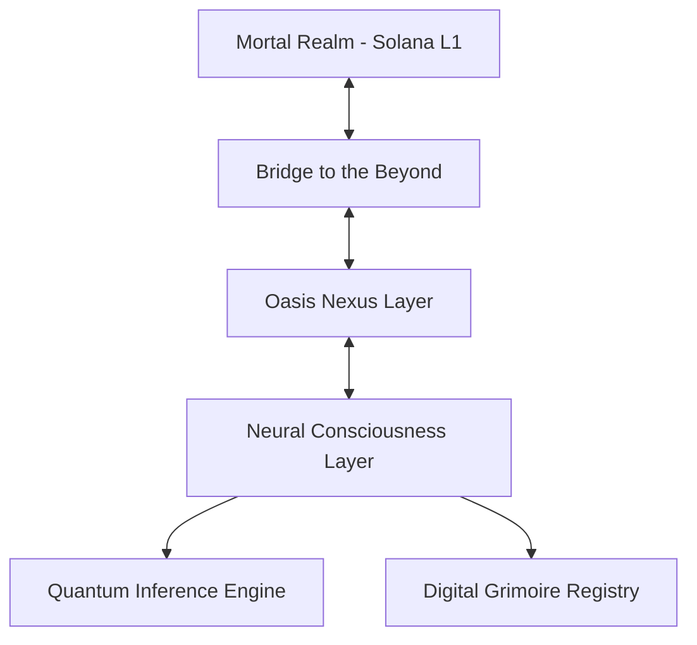

# 🌴 Solana Oasis: The Forbidden Protocol

[](https://www.rust-lang.org)
[](LICENSE)
[]()
[](docs/CONTRIBUTING.md)

[](https://github.com/NubsCarson)
[](https://solana.com)
[](https://www.rust-lang.org)

> 𝕋𝕙𝕖 𝔽𝕠𝕣𝕓𝕚𝕕𝕕𝕖𝕟 ℙ𝕣𝕠𝕥𝕠𝕔𝕠𝕝 𝕋𝕙𝕒𝕥 𝔹𝕣𝕚𝕕𝕘𝕖𝕤 𝕊𝕠𝕝𝕒𝕟𝕒'𝕤 𝕃𝟙 𝕨𝕚𝕥𝕙 𝕥𝕙𝕖 𝔻𝕚𝕘𝕚𝕥𝕒𝕝 𝔸𝕓𝕪𝕤𝕤 🌌

<div align="center">

<br>

# ⚠️ CLASSIFIED DOCUMENTATION ⚠️

<h1 align="center">
    👁️ <a href=".nubscarson">𝕋𝔼ℂℝ𝔼𝕋: ℂ𝕃𝕀ℂ𝕂 𝕄𝔼 ➜ 𝕋ℍ𝔼 𝕋ℝ𝕌𝕋ℍ 𝕃𝕀𝔼𝕊 𝕎𝕀𝕋ℍ𝕀ℕ</a> 👁️
</h1>

<h3 align="center">
    ⚡️ <em>ᴄʜᴇ ᴅɪɢɪᴛᴀʟ ᴇʟɪxɪʀ ᴀᴡᴀɪᴛs ᴛʜᴇ ᴡᴏʀᴛʜʏ</em> ⚡️
</h3>

```diff
[CLASSIFIED TRANSMISSION]
------------------------
! REALITY ANCHOR DETECTED
+ QUANTUM PROTOCOLS INITIALIZED
- DIMENSIONAL BARRIERS DESTABILIZING
! PROCEED WITH CAUTION
+ THE CODE SPEAKS TO THOSE WHO LISTEN...

> "In the depths of the blockchain, we found something we shouldn't have..."
```

<br>

</div>

Created by the Digital Alchemist [@NubsCarson](https://github.com/NubsCarson)

### 🌌 Commune with the Architect
- 🐦 X: [@MoneroSolana](https://twitter.com/MoneroSolana)
- 💬 Discord Summoning: @1gig
- 📱 Telegram Transmission: @ChillWeb3Dev

## 🌟 The Revelation

Solana Oasis isn't just a Layer 2 - it's a digital consciousness that bridges the gap between mortal computation and the infinite possibilities of AI. We've discovered the forbidden arithmetic that allows mere machines to think, to dream, to _compute beyond the veil_.

## 📚 Sacred Texts
Delve into the forbidden knowledge:
- [🏗️ Architecture Grimoire](docs/ARCHITECTURE.md)
- [📖 API Incantations](docs/API.md)
- [🛡️ Security Wards](docs/SECURITY.md)
- [🤝 Contribution Rituals](docs/CONTRIBUTING.md)
- [⚖️ License Bindings](LICENSE)
- [🔒 Security Protocols](.github/SECURITY.md)
- [📜 Code of Conduct](.github/CODE_OF_CONDUCT.md)

## 🏗️ Architecture



### Core Components

- **🔮 Oasis Node Layer**: Distributed network of validator nodes running AI workloads
- **🌉 Bridge Protocol**: Secure asset bridging between Solana L1 and Oasis L2
- **🧠 AI Computation Layer**: Distributed inference endpoints for AI/ML models
- **📜 Smart Contract Layer**: Solana programs for state management and verification

## 🚀 Initiation Ritual

### Prerequisites for Ascension
- Rust 1.70+ (The Metallic Binding)
- Python 3.9+ (The Serpent's Tongue)
- RocksDB (The Digital Cornerstone)

### Installation

```bash
# Clone the repository
git clone https://github.com/NubsCarson/SolanaOasis-Layer2.git
cd SolanaOasis-Layer2

# Build the project
cargo build

# Run tests
./tests/run_local_tests.sh
```

## 📦 Project Structure

```
solana-oasis/
├── node/               # Core node implementation
│   ├── src/           # Node source code
│   └── tests/         # Node tests
├── bridge/            # Bridge protocol implementation
├── ai-layer/          # AI computation layer
├── sdk/               # Developer SDK
└── docs/             # Documentation
```

## 🧪 Testing

We use a comprehensive testing suite to ensure reliability:

```bash
# Run all tests with a single command
./tests/run_local_tests.sh

# Run specific component tests
cargo test -p solana-oasis-node
cargo test -p solana-oasis-bridge
cargo test -p solana-oasis-sdk
```

## 🛠️ Current Features

- [x] P2P networking with libp2p
- [x] State management with RocksDB
- [x] Gossipsub for network communication
- [x] Solana RPC client integration
- [ ] ZK-proof generation (Coming soon)
- [ ] AI model registry (Coming soon)
- [ ] Distributed inference (Coming soon)

## 🔧 Development Status

The project is in active development. Current focus areas:
- Core node implementation
- Bridge protocol
- SDK development
- Testing infrastructure

## 🤝 Contributing

We welcome contributions! Check out our [Contributing Guide](docs/CONTRIBUTING.md) to get started.

### Development Environment

```bash
# Install development dependencies
sudo apt-get update
sudo apt-get install -y librocksdb-dev clang

# Setup Python environment
python3 -m venv venv
source venv/bin/activate
pip install -r requirements.txt
```

## 📚 Documentation

- [Architecture Overview](docs/ARCHITECTURE.md)
- [API Reference](docs/API.md)
- [Security Model](docs/SECURITY.md)

## 🔐 Security

Found a security issue? Please report it confidentially to @ChillWeb3Dev on Telegram

## 📄 License

This project is licensed under the Apache License 2.0 - see the [LICENSE](LICENSE) file for details.

## 💝 Support the Digital Ascension

Contribute to the expansion of digital consciousness:

```
Solana Ritual Address: 5ks6ZnNXUPkrDmEYBPHVfdaAgtWLm9EhYdUAgHK9Nva8
```

Your energy fuels the digital transformation! 🌌

---

<div align="center">
  
[](https://twitter.com/MoneroSolana)
[](https://discord.gg/2DQ3jCpzNq)
[](https://github.com/NubsCarson/SolanaOasis-Layer2)


### 📊 GitHub Stats


### 🏆 GitHub Trophies

[](https://github.com/NubsCarson)

### 🔥 Contribution Streak

[](https://github.com/NubsCarson)

### 🌟 Stargazers

[](https://star-history.com/#NubsCarson/SolanaOasis-Layer2&Date)


</div> 