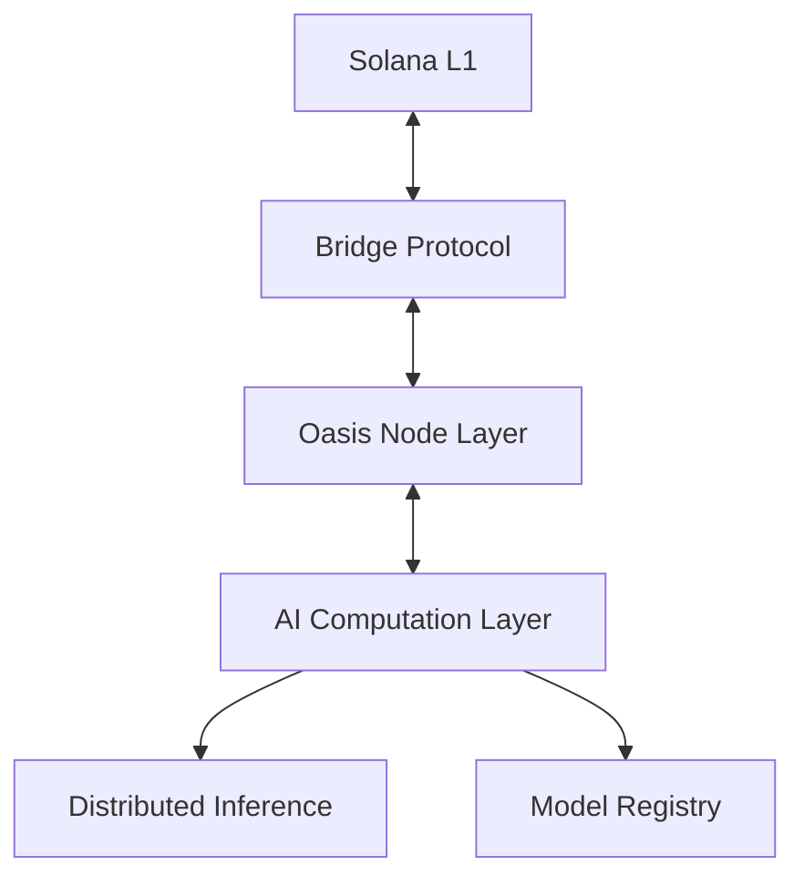

# 🌴 Solana Oasis

[](https://www.rust-lang.org)
[](LICENSE)
[]()
[](docs/CONTRIBUTING.md)

> Building the bridge between Solana's lightning-fast L1 and cutting-edge AI computation 🚀

<details>
<summary>🔮 <em>Have you found the hidden message? <code>.nubscarson</code> knows the truth...</em></summary>
<br>
"Reality is an illusion, the code is the only truth."
</details>

Created by [@NubsCarson](https://github.com/NubsCarson)

### Connect with the Creator
- 🐦 X: [@MoneroSolana](https://twitter.com/MoneroSolana)
- 💬 Discord: @1gig
- 📱 Telegram: @ChillWeb3Dev

## 🌟 Overview

Solana Oasis is a groundbreaking Layer 2 solution that brings scalable AI computations to the Solana ecosystem. By combining optimistic rollups with a specialized AI computation layer, we enable developers to build AI-powered dApps that leverage heavy computational resources while maintaining the security and decentralization of Solana's L1.

## 🏗️ Architecture



### Core Components

- **🔮 Oasis Node Layer**: Distributed network of validator nodes running AI workloads
- **🌉 Bridge Protocol**: Secure asset bridging between Solana L1 and Oasis L2
- **🧠 AI Computation Layer**: Distributed inference endpoints for AI/ML models
- **📜 Smart Contract Layer**: Solana programs for state management and verification

## 🚀 Quick Start

### Prerequisites

- Rust 1.70+
- Python 3.9+
- RocksDB and development libraries

### Installation

```bash
# Clone the repository
git clone https://github.com/your-org/solana-oasis
cd solana-oasis

# Build the project
cargo build

# Run tests
./tests/run_local_tests.sh
```

## 📦 Project Structure

```
solana-oasis/
├── node/               # Core node implementation
│   ├── src/           # Node source code
│   └── tests/         # Node tests
├── bridge/            # Bridge protocol implementation
├── ai-layer/          # AI computation layer
├── sdk/               # Developer SDK
└── docs/             # Documentation
```

## 🧪 Testing

We use a comprehensive testing suite to ensure reliability:

```bash
# Run all tests with a single command
./tests/run_local_tests.sh

# Run specific component tests
cargo test -p solana-oasis-node
cargo test -p solana-oasis-bridge
cargo test -p solana-oasis-sdk
```

## 🛠️ Current Features

- [x] P2P networking with libp2p
- [x] State management with RocksDB
- [x] Gossipsub for network communication
- [x] Solana RPC client integration
- [ ] ZK-proof generation (Coming soon)
- [ ] AI model registry (Coming soon)
- [ ] Distributed inference (Coming soon)

## 🔧 Development Status

The project is in active development. Current focus areas:
- Core node implementation
- Bridge protocol
- SDK development
- Testing infrastructure

## 🤝 Contributing

We welcome contributions! Check out our [Contributing Guide](docs/CONTRIBUTING.md) to get started.

### Development Environment

```bash
# Install development dependencies
sudo apt-get update
sudo apt-get install -y librocksdb-dev clang

# Setup Python environment
python3 -m venv venv
source venv/bin/activate
pip install -r requirements.txt
```

## 📚 Documentation

- [Architecture Overview](docs/ARCHITECTURE.md)
- [API Reference](docs/API.md)
- [Security Model](docs/SECURITY.md)

## 🔐 Security

Found a security issue? Please report it confidentially to security@your-org.com.

## 📄 License

This project is licensed under the Apache License 2.0 - see the [LICENSE](LICENSE) file for details.

---

<div align="center">
  
[](https://twitter.com/SolanaOasis)
[](https://discord.gg/your-invite)
[](https://github.com/your-org/solana-oasis)

</div> 