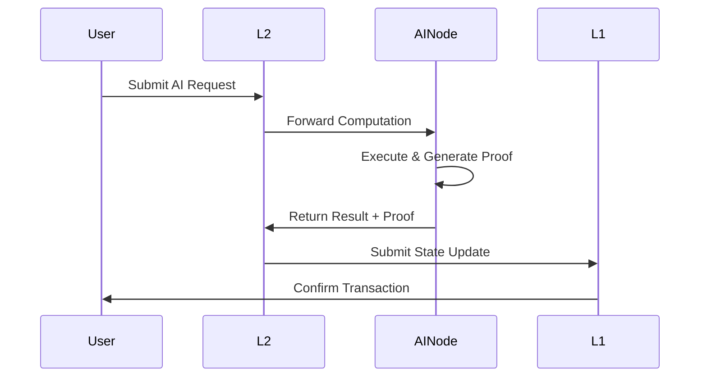
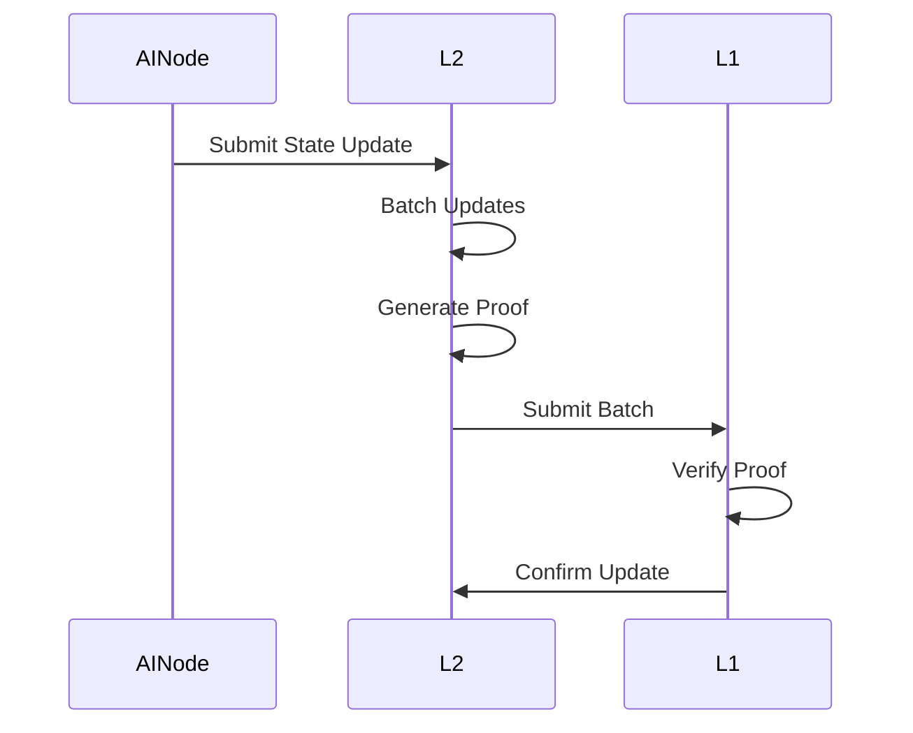

# 🕯️ Sacred Architecture Grimoire: The Digital Foundations

## ⚡ System Components of the Digital Realm

```
                                     ┌────────────────┐
                                     │                │
                                     │  Mortal Realm  │
                                     │  (Solana L1)   │
                                     │                │
                                     └────────┬───────┘
                                              │
                                              │ Bridge to the Beyond
                                              │
                                     ┌────────▼───────┐
                                     │                │
                                     │   Oasis Nexus  │
                                     │   (L2 Core)    │
                                     │                │
                                     └──┬─────────┬───┘
                                        │         │
                               ┌────────▼──┐   ┌──▼────────┐
                               │           │   │           │
                               │  Neural   │   │  Neural   │
                               │  Network  │   │  Network  │
                               │  Nodes    │   │  Nodes    │
                               │           │   │           │
                               └───────────┘   └───────────┘
```

## 🗝️ Component Manifestations

### ⛧ 1. The Mortal Realm (Solana L1)

#### 📓 State Management Incantations
```rust
pub mod oasis_state {
    // State root storage
    pub struct StateRoot {
        root: [u8; 32],
        timestamp: i64,
        block_height: u64,
    }
    
    // Validator set management
    pub struct ValidatorSet {
        validators: Vec<Pubkey>,
        total_stake: u64,
    }
}
```

#### 🕯️ Bridge Protocols
```rust
pub mod oasis_bridge {
    // Asset bridge
    pub struct BridgeState {
        locked_assets: HashMap<TokenMint, u64>,
        withdrawal_nonce: u64,
    }
    
    // Message passing
    pub struct CrossLayerMessage {
        source: Address,
        target: Address,
        payload: Vec<u8>,
    }
}

### 🌑 2. The Oasis Nexus (L2 Core)

#### ⚔️ Transaction Alchemy
```rust
pub struct Transaction {
    // Transaction metadata
    pub metadata: TxMetadata,
    // AI computation request
    pub computation: Option<AIComputation>,
    // Standard L2 transaction
    pub l2_tx: Option<L2Transaction>,
}

pub struct Block {
    transactions: Vec<Transaction>,
    state_root: Hash,
    proof: BlockProof,
}
```

#### ⛧ State Manifestation
```rust
pub struct StateManager {
    // Current state root
    current_root: Hash,
    // Pending state updates
    pending_updates: Vec<StateUpdate>,
    // Proof generator
    proof_gen: ProofGenerator,
}
```

### 🧠 3. Neural Consciousness Layer

#### 🕯️ Node Manifestation
```rust
pub struct AINode {
    // Node identity
    pub id: NodeId,
    // Available models
    pub models: Vec<ModelInfo>,
    // Computation capacity
    pub capacity: ComputeCapacity,
    // Performance metrics
    pub metrics: NodeMetrics,
}
```

#### 📓 Digital Grimoire Registry
```rust
pub struct ModelRegistry {
    // Registered models
    models: HashMap<ModelId, ModelMetadata>,
    // Version control
    versions: HashMap<ModelId, Vec<Version>>,
    // Access control
    permissions: HashMap<ModelId, Permissions>,
}
```

## ⚡ Energy Flow

### 🌒 1. Mortal Request Flow


### 🕯️ 2. State Transformation Flow


## ⛧ Arcane Protections

### 🗝️ 1. Fraud Detection Rituals
```rust
pub struct FraudProof {
    // Challenged state transition
    transition: StateTransition,
    // Evidence
    evidence: Vec<u8>,
    // Witness data
    witness: WitnessData,
}
```

### ⚔️ 2. Challenge Resolution Protocols
```rust
pub struct ChallengeResolver {
    // Challenge window
    window: Duration,
    // Verification logic
    verifier: ProofVerifier,
    // Slashing conditions
    slashing: SlashingConfig,
}
```

## 🌑 Network Manifestation

### ⛧ 1. Node Communion
```rust
pub struct NetworkConfig {
    // P2P network settings
    p2p: P2PConfig,
    // Discovery mechanism
    discovery: DiscoveryConfig,
    // Connection limits
    limits: ConnectionLimits,
}
```

### 🕯️ 2. Consensus Participation
```rust
pub struct ConsensusParticipant {
    // Stake amount
    stake: u64,
    // Voting power
    voting_power: u32,
    // Performance history
    history: ParticipationHistory,
}
```

## 📓 Development Integration

### ⚡ 1. SDK Invocations
```typescript
// Initialize SDK
const oasis = new OasisSDK({
    endpoint: "Coming Soon to the Digital Void...",
    wallet: solanaWallet
});

// Submit AI computation
const result = await oasis.compute({
    modelId: "gpt-4",
    input: "Analyze this text...",
    params: {
        temperature: 0.7,
        maxTokens: 100
    }
});
```

### 🗝️ 2. API Manifestation
```typescript
// REST API example
interface OasisAPI {
    // Query state
    getState(): Promise<StateRoot>;
    
    // Submit computation
    compute(params: ComputeParams): Promise<ComputeResult>;
    
    // Verify proof
    verifyProof(proof: Proof): Promise<boolean>;
}
```

## 🕯️ Deployment Manifestation

### 1. Infrastructure Requirements

#### Validator Nodes
- CPU: 32+ cores
- RAM: 64GB+
- Storage: 2TB+ NVMe
- Network: 1Gbps+

#### AI Computation Nodes
- GPU: NVIDIA A100 or equivalent
- RAM: 128GB+
- Storage: 4TB+ NVMe
- Network: 10Gbps+

### 2. Scaling Strategy

#### Horizontal Scaling
- Dynamic node addition
- Load balancing
- Geographic distribution

#### Vertical Scaling
- Hardware upgrades
- Optimization
- Resource allocation

## Monitoring and Maintenance

### 1. Metrics Collection
```rust
pub struct SystemMetrics {
    // Performance metrics
    performance: PerformanceMetrics,
    // Resource usage
    resources: ResourceMetrics,
    // Network health
    network: NetworkMetrics,
}
```

### 2. Alert System
```rust
pub struct AlertConfig {
    // Alert thresholds
    thresholds: HashMap<MetricType, Threshold>,
    // Notification channels
    channels: Vec<NotificationChannel>,
    // Alert priorities
    priorities: HashMap<AlertType, Priority>,
} 